# Installing Raspberry PI OS for Embedded Projects

These are my notes on how I image and configure SD cards for Raspberry PIs to use for projects that I share on YouTube.

Note that there is a [YouTube Video](https://youtu.be/Mty1iGqhYuU) that discusses this REPO and shows the `rpi-imager` I used as well as how I then edited other configuration settings on the PI after it has booted the first time.

## 2026-01-01 Update!

The version described here is installed by using `rpi-imager` that can be run on any system that supports it.  
I used a leap-frog approach to setting up a PI with a desktop that, in turn, is used to run the latest imager to configure an SD card for a headless PI.

If the latest imager works on your exisating system then use it.  Else see below how I created an SD on my Linux desktop without an imager.

## The chicken & egg problem

WHen I tested some older `rpi-imager` releases (prior to 2.0), they did get a bootable image of Trixie onto an SD card.  But they didn't actually *configure* the image (so creating an SD card for a headless PI was unsuccessful.)  But they did get Trixie onto the SD card in a way that it did boot on a PI with a keyboard & display that could, then, be configured by filling out the menu prompts that will appear during the first boot.

Alternately, you can use any Unix(ish) box to manually copy the OS desktop image onto an SD card (again, without configuring it.)

Therefore, this method can be used to create a new desktop system on a PI that can be used to run the `rpi-imager` *and* configure an SD card for use on a headless system!

# Burning an SD card (without rpi-imager) to boot a desktop on a PI

**WARNING** Doing this incorrectly can instantly, unrecoverably, destroy the filesystem on the machine you are using. Do not do this if you don't understand the process!!!!! **DO NOT blindly copy these commands expecting everything will be OK.**

Download the latest OS image from raspberrypi.com.  The one I used while writing these notes is:

	wget https://downloads.raspberrypi.com/raspios_arm64/images/raspios_arm64-2025-12-04/2025-12-04-raspios-trixie-arm64.img.xz

Insert the SD card you want to image and identify the device name.  Depending on the SD card adapter you are using and the configuration of your machine, it can be any one of a number of places.  This is the critical thing to get right.  Consider using commands like `lsblk` to locate the SD card, then remove the SD card, run `lsblk` again, note that it has gone away, and then finally returns when it is plugged back in... for an absolute positive confirmation of the SD card's device name.

If your machine mounts whatever existing junk might be on your SD card, you will want to unmount it like this:

	sudo umount /dev/sdXXXX

I then wipe and program the SD card like this (on my system, the SD card is `/dev/sdb`):

	SD=/dev/sdb
	sudo dd if=/dev/zero of=$SD bs=4M count=1 status=progress conv=fsync
	sudo xzcat 2025-12-04-raspios-trixie-arm64.img.xz | sudo dd of=$SD bs=4M status=progress conv=fsync
	sync

At this point you have a bootable Trixie SD card with a full desktop that is unconfigured.  It can boot on a PI with a keyboard and display.  It will boot into a configuration menu to create a user account, set the timezone and so on.  After that, it can be used to run the latest `rpi-imager` to create an SD card that can boot on a headless PI.

# Burning an SD card using the rpi-imager version 2.x

You can run `rpi-imager` on any system that supports the latest version (including a Raspberry PI.)  As of this writing I was able to use version 2.0.1 on a Raspberry PI running Trixie with a desktop.

## Setting up a headless system to boot with ssh enabled

In order to connect to a PI the first time over the network, I use `ssh` with a public key (that the imager lets you paste into a config form.)  Otherwise you can configure it to let you log in using a password.

Run the imager:

	sudo rpi-imager

Follow the bouncing ball...

### Select your favorite language:

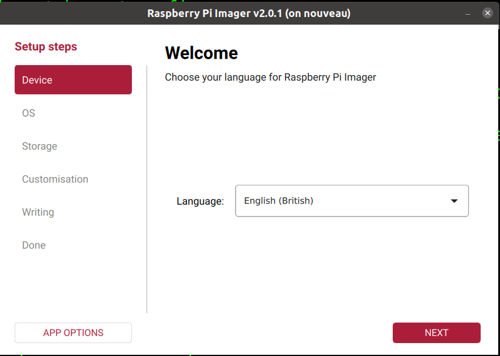

### Select Your Board
I am using a PI 4B:

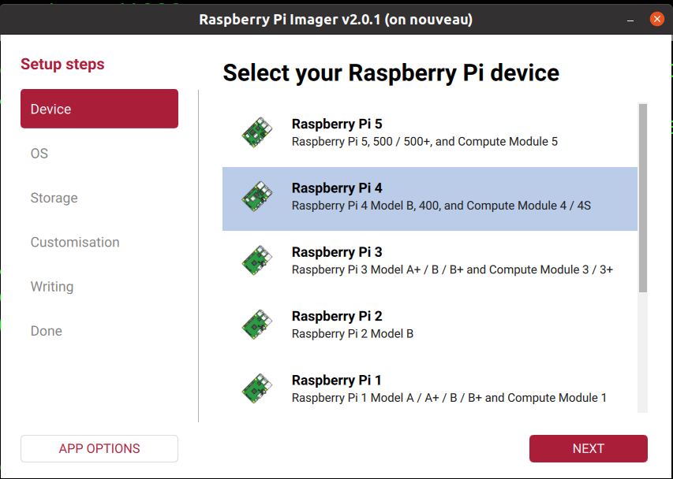

### Select the OS to install.
To boot headless, scroll down & select "Raspberry PI OS (other)."

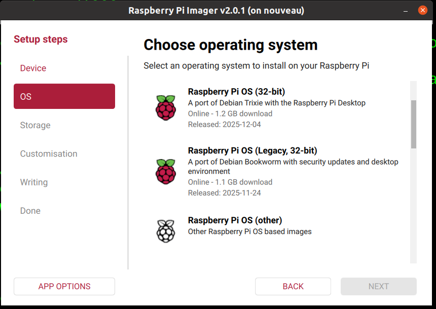

### Click on Raspberry PI OS Lite (64-bit).

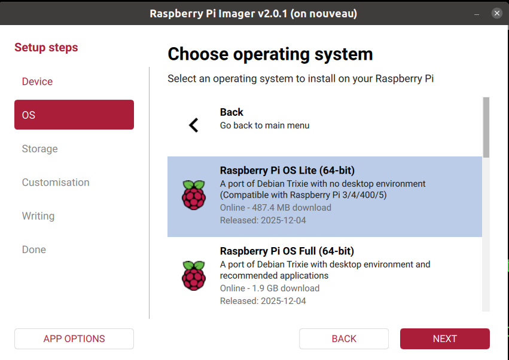

### Insert your SD card.
I use a USB adapter. It will appear in Storage Device menu once plugged in.

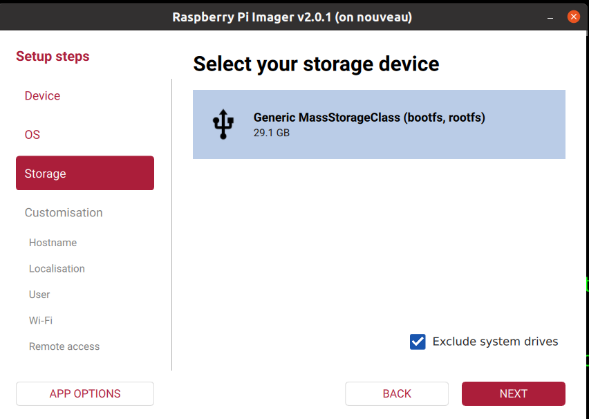

### Set your new PI's hostname.
I named mine "retro"

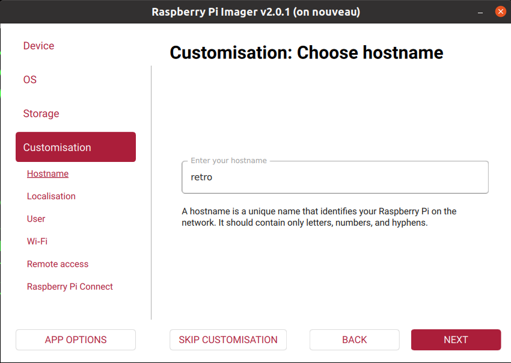

### Set the Timezone & Keyboard type.
Mine is Chicago & US.  (I ignore the Capital City box.)

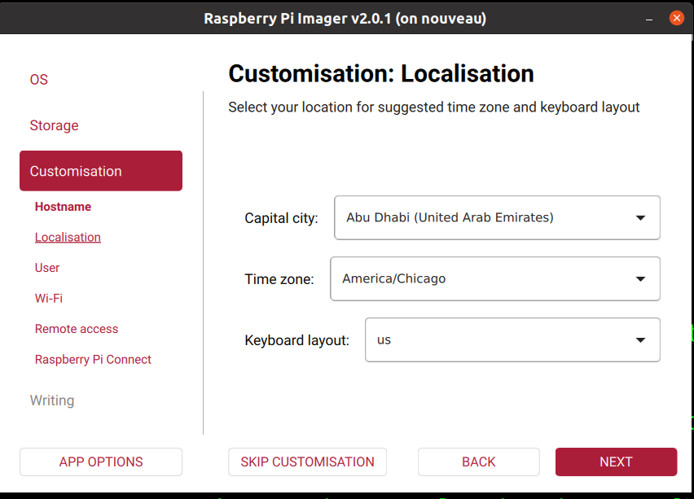

### Create a user login & set a password.

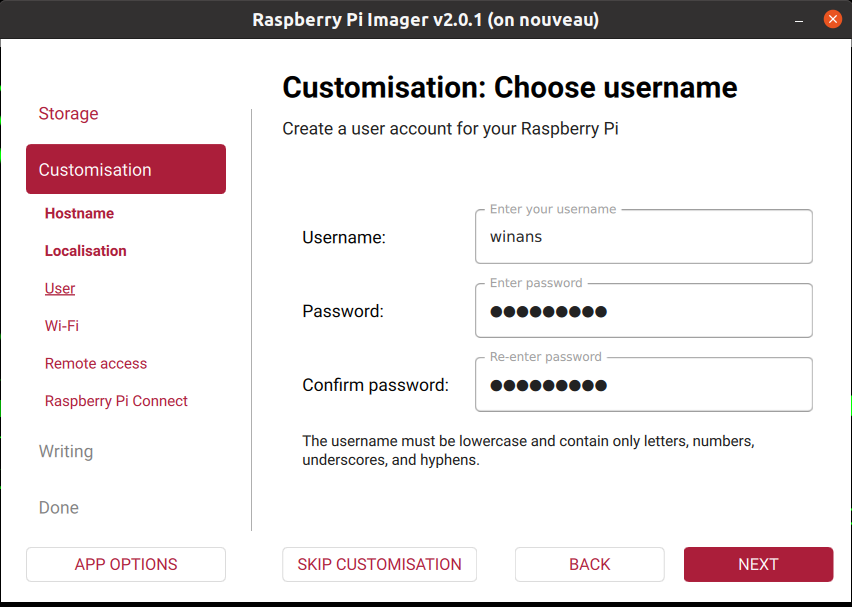

### If you use WiFI, configure it here.
I use hard-wire Ethernet. So I leave this all unset/blank.

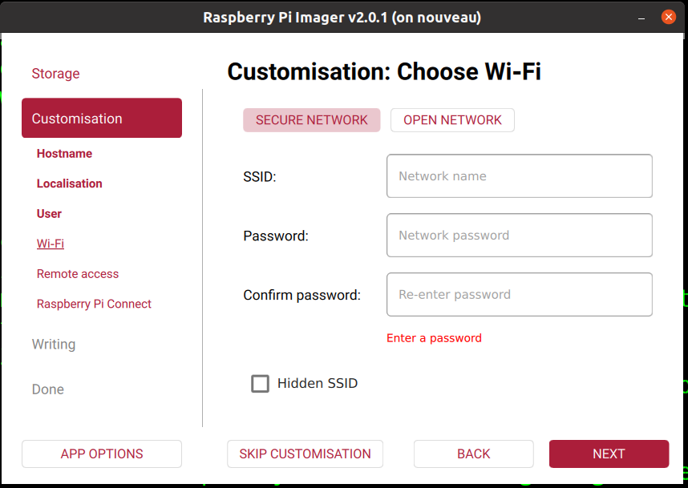

### Set a password or paste in your SSH public key.
I use a SSH public key.

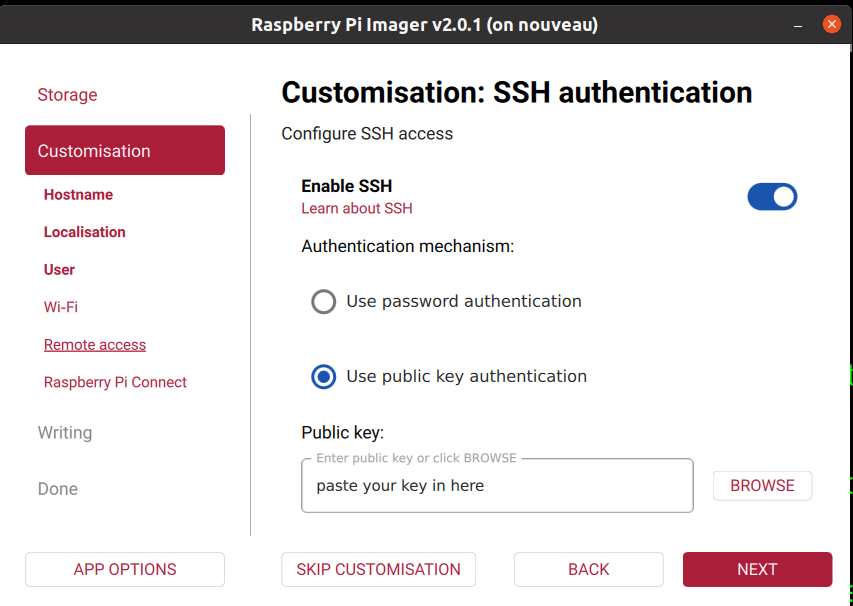

### I do not use Raspberry PI Connect.
I leave this turned off.

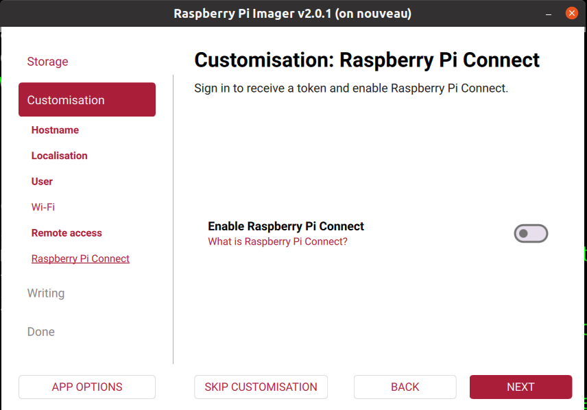

### Final summary. Click the **write** button and get a cup of coffee.

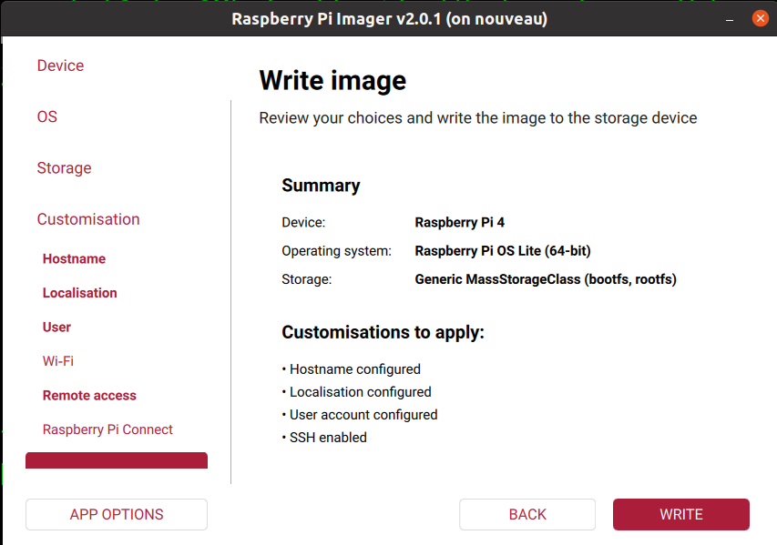

When done imaging a new SD card, insert it into a PI, boot it, and finish configuring it.

# Connect to and finish configuring the headless PI

If you assigned the hostname `retro` when configuring your PI with the imager, you can log into it from a terminal on another machine on the same LAN like this:
```
ssh retro.local
```

If you get odd errors about ssh configurations, you can try to temporairly disable any configs on your local machine with the `-F` option like this (some of my systerms require various modes that are not always available on a new install):
```
ssh -F /dev/null retro.local
```

Once logged into your new PI (either via `ssh` or via keyboard & screen connected directly to your PI):
```
sudo apt update
sudo apt upgrade
sudo apt install vim git
```

Configure `vim` so that it is sane:
```
cat - > ~/.vimrc <<EOF
set ts=4
setlocal cm=blowfish2
set mouse=
set ttymouse=
set noshowmatch
let g:loaded_matchparen=1
:set t_BE=

autocmd FileType make setlocal noexpandtab
autocmd FileType asm setlocal tabstop=8 expandtab
autocmd FileType verilog setlocal tabstop=4 shiftwidth=4 expandtab
autocmd FileType pcf setlocal tabstop=4 shiftwidth=4 expandtab
syntax on

set tabstop=4 shiftwidth=4 noexpandtab
EOF
```

Copy the same into the root home directory:

```
sudo cp ~/.vimrc ~root/
```

Add the following to the bottom of `~/.bashrc`:
```
export LC_CTYPE=C
export LC_ALL=C
export COLLATE=POSIX
export EDITOR=vi

# nix the annoying quoted ls output...
export QUOTING_STYLE=literal
alias ll='ls -lF --color=auto'
alias ls='ls -F --color=auto'
```

Run `raspi-config` in a terminal window and set the following options:
```
        System Options
            Boot
                Console Text console
                Console autologin is disabled
        Interfacing Options / Interface Options
            SSH enabled (this is still on from the imager earlier)
            RPi Connect (disabled)
            VNC (ignored?)
            SPI interface is enabled
            I2C interface is enabled
            Serial Port
                The serial login shell is disabled
                The serial interface is enabled
            1-Wire (disabled)
        Advanced Options
            Beta Access
                Release Software Use the release software repository
            Wayland
                X11 Openbox window manager with X11 backend
            Shutdown Behaviour
                Full Power off
```
I don't use wifi:
```
sudo systemctl stop wpa_supplicant.service
sudo systemctl disable wpa_supplicant.service
```

I usually reboot and relogin here to make sure I did not break anything.

Set up hardware features that you need for your project(s):
```
sudo vi /boot/firmware/config.txt
```

Add the following to the bottom of the file:
```
[all]
enable_uart=1

# shut off unwanted services
dtoverlay=disable-wifi
dtoverlay=disable-bt

# Allow monitor attach after boot (legacy, but works)
hdmi_force_hotplug=1
hdmi_group=1            # use CEA modes
hdmi_mode=16            # 1080p60

# enable I2C on the Retro for the firmware programmer
#dtparam=i2c_arm=on,i2c_arm_baudrate=400000 # conflict w/I2C on Retro

# enable an extra LVTTL UART on the Nouveau
#dtoverlay=uart3,ctsrts                     # conflict with SPI0_CE1_N on Nouveau
#dtoverlay=uart3                            # GPIO 4, 5
#dtoverlay=uart2,ctsrts                     # GPIO 0, 1, 2, 3   (conflict on Retro)
#dtoverlay=uart2                            # GPIO 0, 1
```

When the PI will not be used with bluetooth, I remove the drivers like this:

	sudo apt purge bluez -y
	sudo apt autoremove -y

I reboot at this point for good measure.

Prepare your `git` environment for future use:

	sudo apt install git
	git config --global user.email "me@example.com"
	git config --global user.name "John Q. Public"

# Set up SSH

At this point, you should be able to log into the PI with your ssh key.
It is now advisable to disable password-based ssh access to your PI so that noone
can access it over the network without your private ssh key.  To do this, edit
the `/etc/ssh/sshd_config` file and change the following comment line:

	#PasswordAuthentication yes

by making a copy of it (so you remember what the original/default is), remove the 
`#` and change the `yes` to `no` so it looks like this:

	#PasswordAuthentication yes
	PasswordAuthentication no

This change will not be applied until the next reboot or you restart the `sshd` server like this:

	sudo /etc/init.d/ssh restart


# Install any tools & repos for your project(s)

## Z80-Retro!
```
sudo apt install build-essential libi2c-dev z80asm cpmtools
sudo apt install kicad
sudo apt install minicom

mkdir ~/retro
cd ~/retro
git clone --recurse-submodules git@github.com:Z80-Retro/2063-Z80-cpm.git
git clone git@github.com:Z80-Retro/2065-Z80-programmer.git
git clone git@github.com:Z80-Retro/example-filesystem.git

cd ~/retro/2065-Z80-programmer/pi
make world

cd ~/retro/2063-Z80-cpm
cat - > Make.local <<EOF
SD_HOSTNAME=retro
SD_DEV=/dev/sdb1
EOF
make
cd boot
~/retro/2065-Z80-programmer/pi/flash < firmware.bin
cd ../filesystem
make burn
minicom -D /dev/ttyUSB0
```			

## Z80-Nouveau

```
sudo apt install build-essential libi2c-dev z80asm cpmtools
sudo apt install iverilog gtkwave fpga-icestorm yosys nextpnr-ice40 flashrom
sudo apt install kicad
sudo apt install minicom

cd ~
mkdir ~/fpga
cd ~/fpga
git clone --recurse-submodules git@github.com:Z80-Retro/2063-Z80-cpm.git
git clone git@github.com:Z80-Retro/example-filesystem.git
git clone git@github.com:johnwinans/2057-ICE40HX4K-TQ144-breakout.git
git clone git@github.com:johnwinans/2067-Z8S180.git
git clone git@github.com:johnwinans/Verilog-Examples.git

# make sure everything works:
cd ~/fpga/2063-Z80-cpm

cat - > Make.local <<EOF
CROSS_AS_FLAGS=-I../lib -I../libnouveau
BOOT_MSG=Z80 Nouveau
SD_HOSTNAME=retro
SD_DEV=/dev/sdb1
EOF

make world

cd ~/fpga/2067-Z8S180/fpga/nouveau-vdp99
make world
make prog
minicom -D /dev/ttyAMA0
```
